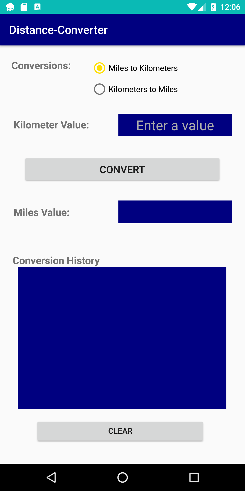
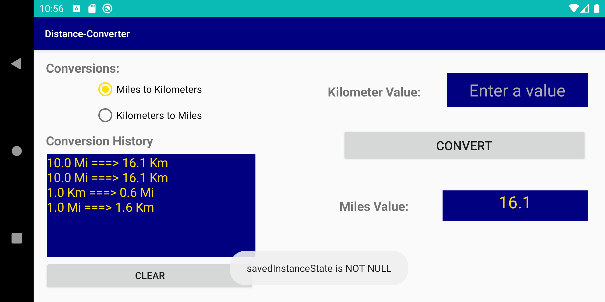

## Distance Converter Android App

The app allows the user to select either ```Miles-to-Kilometersor``` or ```Kilometers-to-Miles``` conversions.

### User interface 


 
<a href="url"></a>
<nl>
 <br>
 <br>
 <br>
 <br>
 <br>
Type of conversion is selected using ```Radio Buttons``` which are grouped in a ```Radio Group```. ```Miles-to-Kilometers``` radio button is selected by default. The distance value (the value to be converted) is entered by the user. Values can be positive or negative and only numeric whole or decimal values are allowed. 

Pressing the ```Convert``` button will clear the input field, generate the converted distance value and display it on the ```Conversion History``` text field. The history of converted values is scrollable and displayed with the most recent conversions at the top of the list. 
<br>
<a href="url"></a>
Landscape layout. Changing layout does not lost the data on any field.


Pressing the “Clear” button will clear the conversion history.


