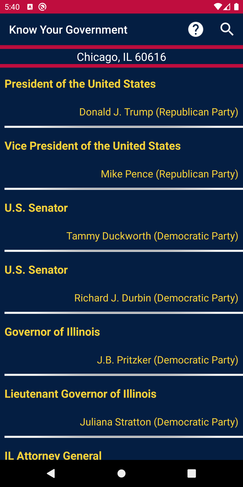
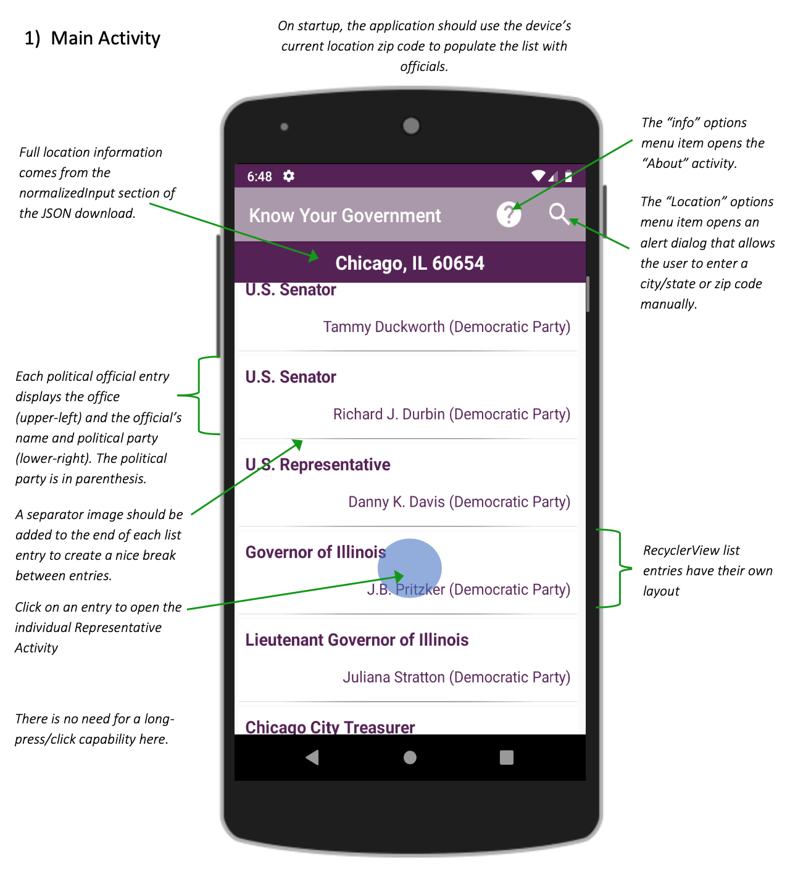
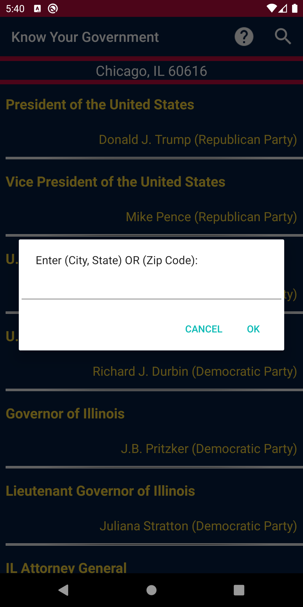
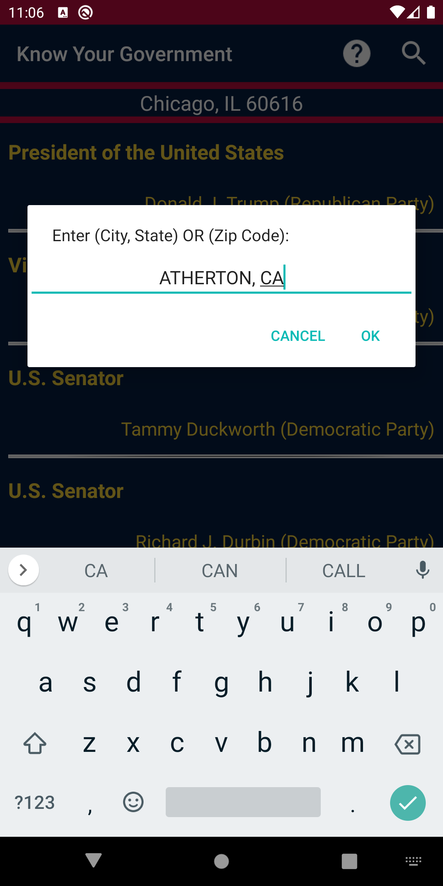
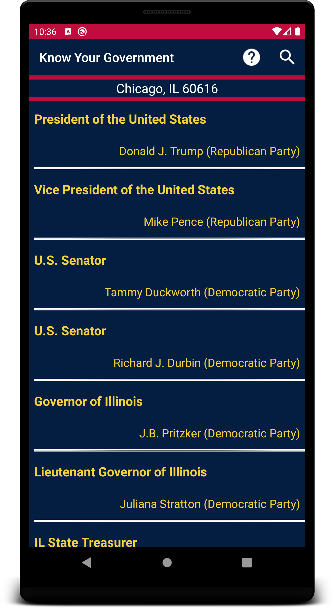

## Know Your Government

##### Published Date: 11/11/2020

### Application Flow Diagrams


<a href="pic/main_page.png"></a>  

* This app will acquire and display an interactive list of political officials that represent the current location (or a specified location) at each level of government.

* Android location services will be used to determine the user’s location.

* The [Google Civic Information API](https://developers.google.com/civic-information/) will be used to acquire the government official data (via ```REST``` service and
```JSON``` results). .

* Clicking on an official’s list entry opens a detailed view of that individual government representative.

* An ```About``` activity will show application information (Author, Copyright data & Version)

* Clicking on the photo of an official will display a ```Photo Activity```, showing a larger version of the photo.

* Permissions for `ACCESS_FINE_LOCATION` and `INTERNET`

<br>
<br>
<br>
<br>
<br>
<br>
<br>
<br>
<br>
<br>
<br>
<br>
<br>
<br>
<br>
 
### Application Behavior Diagrams:

#### 1) Main Activity

<a href="pic/application_behavior_main.png"></a>  

__Note__: Icons for the all menu and edit items are from Google’s Material Design icon set (https://material.io/icons/)

> 1. Manually setting the location - Enter City, State (E.g.: Chicago, IL; Las Vegas, NV) or Zip Code (E.g.: 94027, 33480, 60043)

<p float="center">
 
 
 
</p>

> 2. Opening the info page:

<a href="pic/info.png">
<div align="center"></div>
</a>

Clicking on [Google Civic Information API](https://developers.google.com/civic-information/) shall navigate the user to the API website. Clicking on developer's name shall direct the user to the Github page [Quananhle](https://github.com/Quananhle) or the Version shall direct the user to the Github page [KnowYourGovernment](https://github.com/Quananhle/OOP-and-Android-App-Development/tree/master/Android-App-Developer/App/KnowYourGovernment) where the source code of the application is published.


3. Adding a stock with no Network Connection – test using “Airplane Mode”(No buttons on the error dialog):
<a href="pic/Screenshot_airplane_1.png">
<div align="center"></div>
</a>


