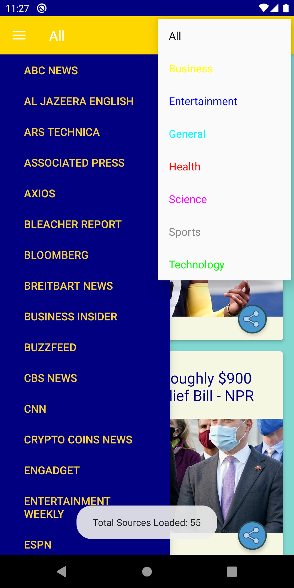
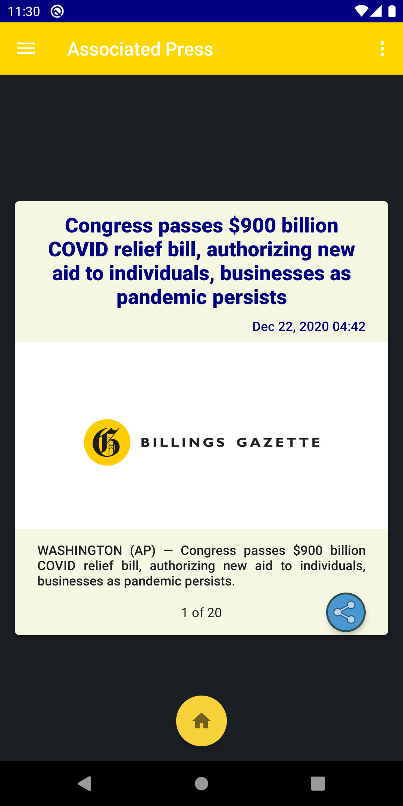

## News Gateway

##### Published Date: 12/03/2020

### Application Flow Diagrams

* This app displays current news articles from a wide variety of news sources covering a range of news categories.

* NewsAPI.org will be used to acquire the news sources and news articles.

* Selecting a news source will display up to 10 top stories from that news source

* News articles are viewed by swiping right to read the next article, and left to go back to the previous article.

* The user can go to the complete extended article on the news source’s website by clicking on the article title, text, or image content.

* Clicking on the Home button will navigate to main page.

### Application Behavior Diagrams:

#### 1) Main Activity

__Note__: Icons for the all menu and edit items are from Google’s Material Design icon set (https://material.io/icons/)

> Selecting a new source

<a href="photo/all_sources.png">

</a>

>> Select a news category from the options menu to limit the news source choices to only those offering that category of news

> Swipe Right (or Left) to scroll through articles from the selected new source:

<a href="photo/AP_news.png">

</a>

 

>> Clicking on [Google Civic Information API](https://developers.google.com/civic-information/) shall navigate the user to the API website. Clicking on developer's name shall direct the user to the Github page [Quananhle](https://github.com/Quananhle) or the all logo shall direct the user to the Github page [KnowYourGovernment](https://github.com/Quananhle/OOP-and-Android-App-Development/tree/master/Android-App-Developer/App/KnowYourGovernment) where the source code of the application is published.

 

> 3. Opening the view of an individual official for details:

 
 

>> Landscape view:

<a href="pic/official_details_2.png">

</a>

 

