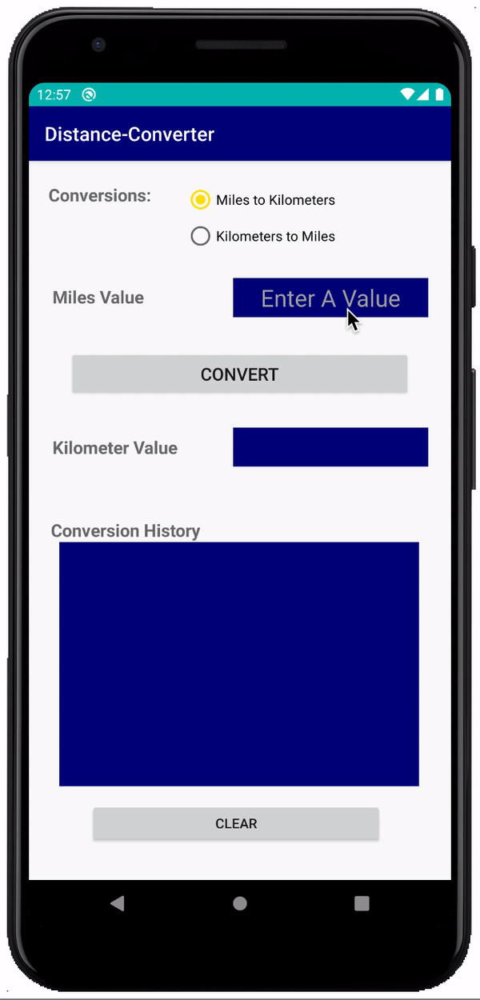
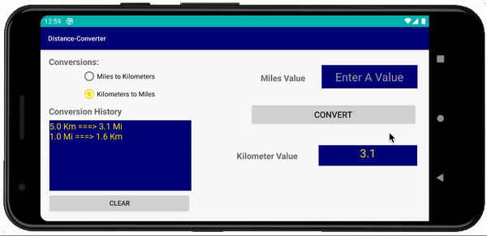
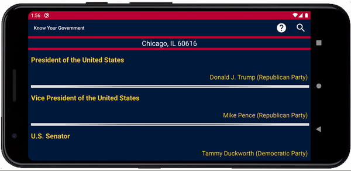

## Android Applications

1. [Distance Converter](https://github.com/Quananhle/OOP-JAVA-and-Android-App-Developer/tree/master/Android-App-Developer/App/DistanceConverter)

<p float="left">
<a href="pictures/converter_vertical.gif"></a>
<a href="pictures/converter_horizontal.gif"></a>
</p>

The app that allows the user to select either ```Miles-to-Kilometers``` or ```Kilometers-to-Miles``` conversions.
        
2. [Multi-Note Pad](https://github.com/Quananhle/OOP-JAVA-and-Android-App-Developer/tree/master/Android-App-Developer/App/MultiNotesApp)        

<a href="pictures/multi_notes.gif"></a>

Uses: ```RecyclerView```, ```Multi-Activity```, ```JSON File```, ```Option-Menus```

This app allows the creation and maintenance of multiple notes. Any number of notes are allowed (including no notes at all). Notes are made up of a title, a note text, and a last-update time.

3. [Stock Watch](https://github.com/Quananhle/OOP-JAVA-and-Android-App-Development/tree/master/Android-App-Developer/App/StockWatch)   

<a href="pictures/stock_watch.gif"></a>

Uses: ```Internet API```, ```RecyclerView```, ```Option-Menus```, ```Multi-threads```, ```JSON Data```, ```Swipe-Refresh```, ```Dialogs```, ```SQLite Database```

This app allows the user to display a sorted list of selected stocks. List entries include the stock symbol (and company name), the current price, the daily price change amount and price percent change.

4. [Know Your Government](https://github.com/Quananhle/OOP-and-Android-App-Development/tree/master/Android-App-Developer/App/knowyourgovernment)   

<p float="left">
<a href="pictures/government_vertical.gif"></a>
<a href="pictures/government_vertical_1.gif"></a>
<a href="pictures/government_horizontal.gif"></a>
</p>

Uses: ```Location Services```, ```Internet API```, ```Google APIs```, ```Images```, ```Picasso Library```, ```Implicit Intents```, ```TextView Links```, ```RecyclerView```, ```JSON Data```

This app will acquire and display an interactive list of political officials that representthe current location (or aspecified location)at each level of government. 

__Note__: The app is completely developed on 2020 after the Election Day 11/03/2020


5. [News Gateway](https://github.com/Quananhle/OOP-and-Android-App-Development/tree/master/Android-App-Developer/App/NewsGateway)   

Uses: ```Service```, ```Broadcasts & Receivers```, ```Drawer Layout```, ```Fragments```, ```ViewPager```, ```Implicit Intents```, ```TextView Links```, ```RecyclerView```, ```Internet API```, ```NEWS API```, ```JSON Data```

This app displays current news articles from a wide variety of news sources covering a range of news categories.
